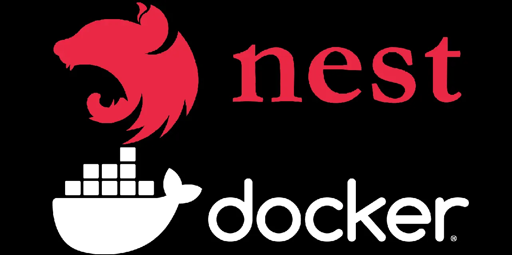

<p align="center"></p>

# NestJS + Docker: Good Defaults for Production-Ready Services

> Inspired by best practices from talented practitioners like Brett Fisher, whose guidance I've followed for over a decade.

This repository demonstrates how I package and run NestJS applications with Docker using opinionated defaults that
balance simplicity, performance, and maintainability.

Most examples online either stop at a Dockerfile for local testing or drown you in Kubernetes/CI/CD specifics.
This repo focuses on the middle ground: good defaults that actually work for production microservices, without
overengineering.

## Why Another NestJS + Docker Example?

- **Real-world context.** These defaults are based on proven best practices for production-ready Node.js services using NestJS.
- **Optimized for DX and Ops.** Simple to build, secure, and predictable images suitable for production.
- **Patterns, not snippets.** You can reuse this structure across projects, not just copy/paste a Dockerfile.

## Key Principles

1. **Security first.** Use node:22-alpine (current LTS, small, maintained, minimal attack surface).
2. **Multi-stage builds.** Keep images small by separating build and runtime stages.
3. **Reproducibility.** Deterministic installs (npm ci / pnpm install --frozen-lockfile).
4. **Non-root runtime.** Containers drop privileges → run as unprivileged user.
5. **Operational hygiene.** Containers provide health checks and log cleanly.

## What's Inside

This template provides production-ready defaults for NestJS applications:

### 🐳 Docker & Containerization

- Multi-stage Dockerfile with security hardening
- Non-root user, minimal attack surface
- External health checks for container monitoring
- Production-ready image optimization

→ See [Docker Usage](./docs/DOCKER.md) for details

### 🛠️ Code Quality & Developer Experience

- ESLint + Prettier with TypeScript rules
- Husky Git hooks for pre-commit/pre-push checks
- Coverage thresholds (80%) enforced in CI/CD
- GitHub Actions CI workflow

→ See [Development Workflow](./docs/DEVELOPMENT.md) for details

### 🔒 Security & Configuration

- Helmet middleware with essential security headers
- CORS configuration with environment-specific settings
- Rate limiting with configurable throttling
- Environment-aware configuration management

→ See [Configuration Guide](./docs/CONFIGURATION.md) for details

## Quick Start

### Docker

```shell
# Build and run
docker build -t my-nest-service:latest .
docker run --rm -p 3000:3000 my-nest-service:latest
```

### Local Development

```shell
# Install dependencies
npm install

# Start development server
npm run start:dev
```

See [docs/DOCKER.md](./docs/DOCKER.md) for detailed Docker usage.

## Documentation

- **[Docker Usage](./docs/DOCKER.md)** - Docker build, run, and environment configuration
- **[Configuration Guide](./docs/CONFIGURATION.md)** - All configuration options and customization
- **[Development Workflow](./docs/DEVELOPMENT.md)** - Code quality, testing, and CI/CD
- **[Logging](./docs/LOGGING.md)** - Pino logging configuration and Grafana stack setup

## Assessments

### Dockerfile Assessment

**Score:** 9.7 / 10  
**Strengths:** Security hardening, clean architecture, attack surface reduction, full documentation  
**Verdict:** Production-ready, enterprise-hardened, passes security audits

### Code Quality Tooling Assessment

**Score:** 9.5 / 10  
**Strengths:** Comprehensive ESLint/Prettier setup, automated Git hooks, coverage enforcement  
**Verdict:** Enterprise-grade development workflow with automated quality gates

### Security Assessment

**Score:** 9.8 / 10  
**Strengths:** Essential security headers, CORS configuration, rate limiting, comprehensive testing  
**Verdict:** Complete security implementation with proper testing coverage

## 📖 Related Articles

### 🐳 Docker & Containerization

**Production-Ready Docker for NestJS: Good Defaults That Actually Work**  
➡️ [Read the full article](https://medium.com/javascript-in-plain-english/production-ready-docker-for-nestjs-good-defaults-that-actually-work-0ec57d994e64)

### 🛠️ Code Quality & Developer Experience

**Code Quality & Developer Experience in NestJS: How Not to Kill Your Team**  
➡️ [Read the full article](https://medium.com/javascript-in-plain-english/code-quality-developer-experience-in-nestjs-how-not-to-kill-your-team-2c434f790f44)

### 🔒 Security & Production Defaults

**Secure Your NestJS Application: Production-Ready Defaults for Safety and DX**  
➡️ [Read the full article](https://medium.com/javascript-in-plain-english/secure-your-nestjs-application-production-ready-defaults-for-safety-and-dx-1b6896b1ce74)
